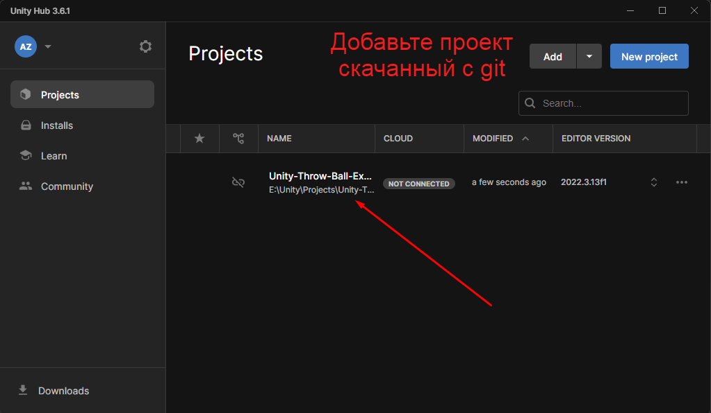
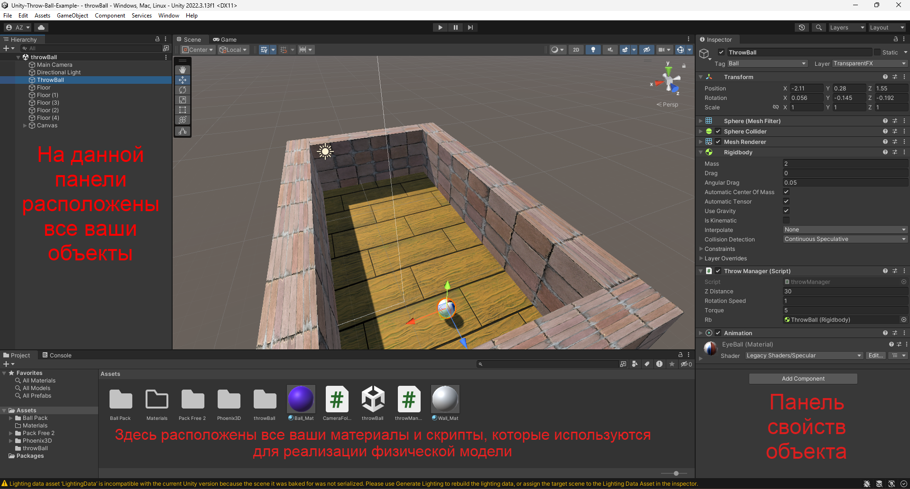
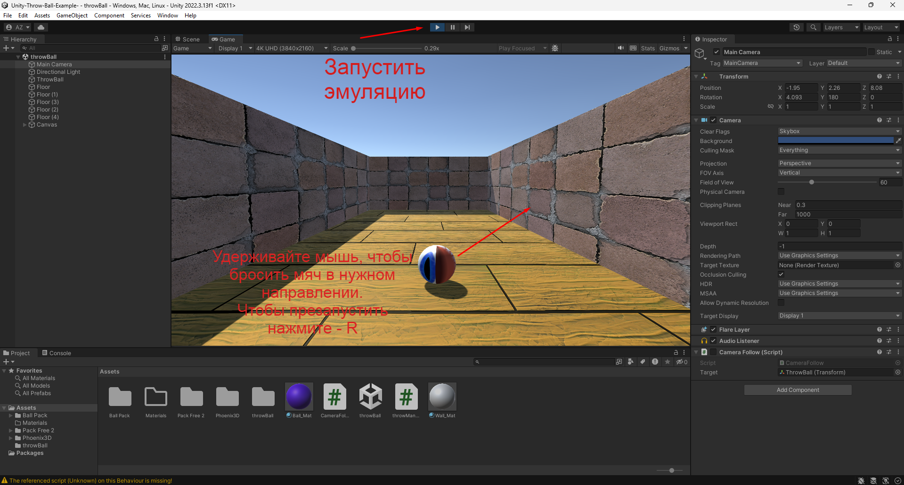

# Physics-Throw-Ball

## Overview

"Physics-Throw-Ball" is a Unity project developed for a Computer Graphics course, aiming to illustrate fundamental principles of physics and game development. The project focuses on creating an interactive environment where users can throw a ball and observe realistic physics-based interactions.

## Features

- Realistic physics simulation: Gravity, collision detection, and projectile motion.
- Interactive environment: Users can throw the ball and observe its trajectory.
- Experimentation: Try different throwing angles and velocities to understand their effects.

## Controls

- **Restart:** Press `R` to restart the simulation.
- **Throw Ball:** Press and hold the `Left Mouse Button`, then move the mouse in the desired direction to determine the ball's throw trajectory.

## Getting Started

1. Open the project in Unity.
   
2. Explore the Unity editor to understand the project structure and settings.
   
   `Main scripts:`
   - [Camera](Unity-Throw-Ball/Assets/CameraFollow.cs)
   - [Ball](Unity-Throw-Ball/Assets/throwManager.cs)
3. Run the project and interact with the simulation.
   
## Example
https://github.com/Alexander-Zadorozhnyy/computer_graphics/assets/66938442/b3510672-3c04-44ae-a74a-9e3e482bafc4

