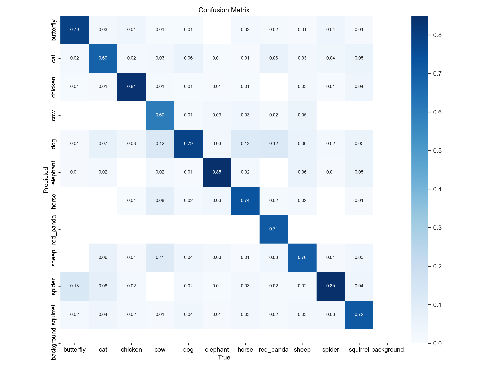

# Computer Graphics Course Laboratory Work

## Object Detection and Classification of Red Pandas using YOLOv8xs

This laboratory work focuses on training a neural network for object detection and classification of red pandas using the YOLOv8xs model. The dataset used for training includes various classes such as:

- butterfly
- cat
- chicken
- cow
- dog
- elephant
- horse
- red_panda
- sheep
- spider
- squirrel

### Dataset

The dataset consists of images annotated with class labels for each object. The primary goal is to train the YOLOv8x model to accurately classify red pandas among the specified classes.

### YOLOv8x Model

The YOLOv8xs (You Only Look Once version 8 extra large) model was chosen for maintaining high accuracy. This model architecture is well-suited for our project, considering the diversity of classes present in the dataset.

### Training

To train the YOLOv8x-cls model on the provided dataset, follow these steps:

1. Navigate to the YOLOv8 directory:
```bash
cd laboratory_work_3
```
2. Install dependencies:
```bash
pip install -U -r requirements.txt
```
3. Prepare the dataset:
Place the dataset in the `dataset` data directory and update the corresponding configuration files.

4. `Optional` Use [utils](utils/delete_duplicates.py) for creating better dataset
5. Train the YOLOv8x-cls model:
```bash
python train.py --model model/yolov8x-cls --imgsz 224 --epoch 10 --batch 10 --augment True 
```

### Confusion Matrix

Confusion matrix for all classes together. In this [folder](media/matrixes) u can find specified confusion matrix for each class compared to red pandas.

